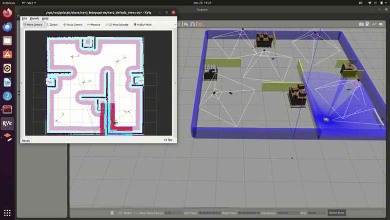

# Group17_final
Here I have uploaded the whole package, instead I should have uploaded only " src" folder of my workspace.
Nevertheless, you can still clone the repository and execute my package.

Author: Keyur Borad (Keyurborad5@gmail.com) 
### System requirement:
1. Ubuntu 20
2. ROS2 Galactic

### Cloning and building the repository
```bash
  # Clones the repository in your system.
  git clone git@github.com:keyurborad5/ROS2-SLAM-Project-Navigation-Through-Poses-.git
  # Delete the build , log and istall folder of the final_ws worksapce
  cd final_ws
  # check all the directories, you should see build, install, log and src
  ls
  # remove unrequired folders
  rm -rf build log install
  # check once again and only src folder shoul be present
  ls
  # Downlaod all dependencies before building it
  rosdep install --from-paths src -y --ignore-src
  # source the underlay and build the package
  source /opt/ros/galactic/setup.bash
  colcon build
  #Now source the overlay
  source install/setup.bash

```
### Launching the Simulation
```bash
  #Set the turtle bot model
  export TURTLEBOT3_MODEL=waffle
  # Launch the gazebo environment
  ros2 launch final_project final_project.launch.py use_sim_time:=True
  #Launch my node
  ros2 launch group17_final my_robot_node.launch.py use_sim_time:=True
  # Alternatively if fail to run the node launch file:
 ros2 run group17_final my_robot_node --ros-args --params-file <path to my package>/group17_final/config/waypoint_params.yaml -p use_sim_time:=True 
  

```
### Simulation Video

